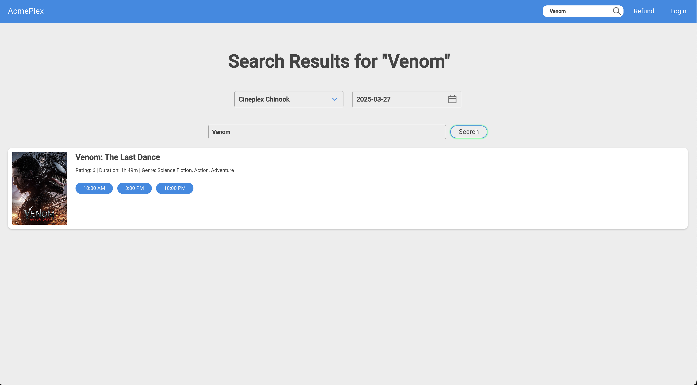
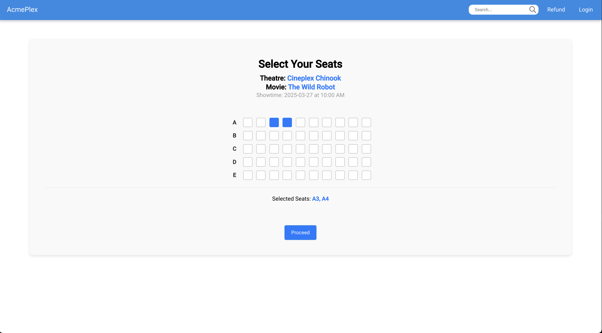

# Movie Ticket App

Movie Ticket App is a modern web application designed to simplify the movie ticket booking experience. Built with React for the frontend and Spring Boot for the backend, it provides a seamless and efficient way to search for movies, check showtimes, and book tickets.

## Design document
[Design document](./assets/DesignDoc-Group16-Final.pdf)

## Demo

Explore the application through the following screenshots:

### Homepage

### Search Page

### Ticket Viewing Page

## Technologies Used

- **React:** Used to build a responsive and dynamic user interface.
- **Spring Boot:** Provides a robust backend with RESTful services.
- Additional libraries and tools to enhance functionality and user experience.
- Stores movies, user accounts, theatres, payment info. 
## Project Structure

The application is organized into two main parts:

- **Frontend:** Contains the React application. Detailed setup and usage instructions are provided in the README file within the frontend folder.
- **Backend:** Contains the Spring Boot application. Refer to the README file in the backend folder for installation and deployment instructions.

## Getting Started

For comprehensive instructions on how to install, configure, and run each part of the application, please refer to the respective README files in the `frontend` and `backend` directories.

## Contribution

This project was made in a team of four as part of a group project. 
Members:
- Frank Ma (Me),
- Jaskirat Singh, 
- Saba Soghraty, 
- Samin Hazeri

## License

This project is licensed under the MIT License.